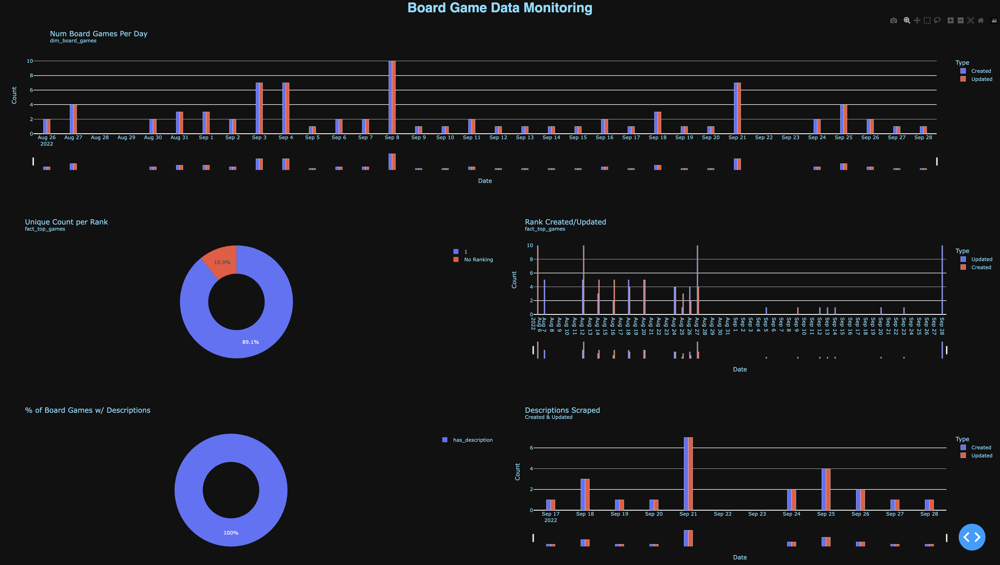

I am a board game fanantic. Meaning, I really like to buy board games, I like to open the box it comes in, peel off the plastic shrink wrap, get somebody else to punch out all of the pieces (I really don't like that part of a new board game), looking at all the pieces, reading the rules, and then putting it on my shelf to collect dust and to never be played. This really doesn't have a lot to do with the project, besides that I spend a lot of time and money collecting games that I will never play. But the question becomes "Which board game do I need next?"

To answer this question, I frequent a couple of board game websites and forums looking at games that are similar to the ones I own, and trying to get people to give me personal recommendations. But I realized that I end up not agreeing with their subjective opinions, or that there were other games that I enjoyed that didn't gain enough popularity and traction to ever warrant a recommendation. What I needed was an source of truth to allow me to find board games that were objectively similar to the ones I owned and liked.

So to start, I needed to start collecting data. Easy enough, just build a web-scraper to scrape the data I needed. Start of simple, and run into issues later. I went onto `https://boardgamegeek.com/` and tried to see if they had an API that I could send get requests to. They did! Unforutnately, it was for single board games, or the hot 100 list. I wanted the top 100 board games. So I had to write up a custom scraper after getting the page source.

To start, I created two functions to query the data I wanted:

```python

def _get_data() -> List:
    url = 'https://boardgamegeek.com/browse/boardgame'
    response = requests.get(url, stream=True)

    response_str = str(response.content)
    response_list = response_str.split("tr id=\\\'row_\\\'")
    del response_list[0] # REMOVING METADATA

    return response_list

def get_top_games() -> List:
    response_list = _get_data()

    # Getting Rank
    rank_pattern = re.compile("name=\"\d+\"")
    name_rank = rank_pattern.search(response_list[1]).group(0)
    rank = name_rank.split('"')[1]

    # Getting the id and name
    href_pattern = re.compile("href=\".*\" >")
    href = href_pattern.search(response_list[1]).group(0)
    id = href.split('/')[2]
    name = href.split('/')[3].split('"')[0]

    # Getting rank, id and name

    # regex patterns
    rank_pattern = re.compile("name=\"\d+\"")
    href_pattern = re.compile("href=\".*\" >")

    top_games = []

    for game in response_list:

        name_rank = rank_pattern.search(game).group(0)
        rank = name_rank.split('"')[1]

        href = href_pattern.search(game).group(0)
        id = href.split('/')[2]
        name = href.split('/')[3].split('"')[0]

        top_games.append((rank, id, name))

    return top_games
```

The `_get_data` function has the best function name I have ever thought of that clearly describes what I am doing (this is sarcasm if you couldn't tell). But it effectively goes and fetches the raw html for the top 100 games. The `get_top_games` function takes the reponse, parses it apart into three key pieces: the overall rank, the board game geek id, and the name of the board game. Now this gets some of the data I need, and provides me a key piece of data that I can use to get any other data I might need, the `board game geek id`, or `id` in the code here.

Now that I started to have data, I needed a place to start storing the data. I spun up a sqlite database (which turned out to be a mistake that I would have to fix later), and started storing all the raw data as strings. The purpose behind ingesting the raw data as all strings into my database is that it allows me to prevent all implicit casting that might cause data issues later on, and allows me to handle the explicit casting of types from strings when needed to ensure the quality of my data. The schema looks this (please don't come after me for using the `TEXT` type. I know it can consume large amounts of memory):

```sql
CREATE TABLE IF NOT EXISTS raw_top_board_games (
    rank TEXT,
    bgg_id TEXT,
    name TEXT
);
```

Great! Getting some data, and a place to store it. Time to get even more data, because how can you build a recommendation system based off of just name and rank. Seems like it would likely just return the next `n` board games closest to it in the top 100. Given that I have all the `board game geek ids` (which I will refer to as `bgg_id` from here on out), I can use the api to request the rest of the data that I need.

```python
def get_all_board_game_data(bgg_id: int) -> list:
    url = f'https://boardgamegeek.com/xmlapi2/thing?id={bgg_id[0]}&stats=1'
    print(url)
    response = requests.get(url, stream=True)

    parsed = xmltodict.parse(response.content)
    if parsed == {'error': {'message': 'Rate limit exceeded.'}}:
        time.sleep(10)
        return get_all_board_game_data(bgg_id)
    else:
        game_data = parsed['items']['item']

    bgg_id = str(bgg_id[0])

    if type(game_data['name']) == list:
        name = game_data['name'][0]['@value']
    else:
        name = game_data['name']['@value']

    description = game_data['description']
    description = _clean_board_game_description(description)
    year_published = game_data['yearpublished']['@value']
    min_players = game_data['minplayers']['@value']
    max_players = game_data['maxplayers']['@value']
    playing_time = game_data['playingtime']['@value']
    min_play_time = game_data['minplaytime']['@value']
    max_play_time = game_data['maxplaytime']['@value']
    min_age = game_data['minage']['@value']

    # Parse apart array data
    board_game_category_ids = []
    board_game_category_values = []
    board_game_mechanic_ids = []
    board_game_mechanic_values = []
    board_game_family_ids = []
    board_game_family_values = []
    board_game_designer_ids = []
    board_game_designer_values = []
    board_game_artist_ids = []
    board_game_artist_values = []
    board_game_publisher_ids = []
    board_game_publisher_values = []
    for item in game_data['link']:
        if item['@type'] == 'boardgamecategory':
            board_game_category_ids.append(item['@id'])
            board_game_category_values.append(item['@value'])
        elif item['@type'] == 'boardgamemechanic':
            board_game_mechanic_ids.append(item['@id'])
            board_game_mechanic_values.append(item['@value'])
        elif item['@type'] == 'boardgamefamily':
            board_game_family_ids.append(item['@id'])
            board_game_family_values.append(item['@value'])
        elif item['@type'] == 'boardgamedesigner':
            board_game_designer_ids.append(item['@id'])
            board_game_designer_values.append(item['@value'])
        elif item['@type'] == 'boardgameartist':
            board_game_artist_ids.append(item['@id'])
            board_game_artist_values.append(item['@value'])
        elif item['@type'] == 'boardgamepublisher':
            board_game_publisher_ids.append(item['@id'])
            board_game_publisher_values.append(item['@value'])


    board_game_category_ids = '|'.join(board_game_category_ids)
    board_game_category_values = '|'.join(board_game_category_values)
    board_game_mechanic_ids = '|'.join(board_game_mechanic_ids)
    board_game_mechanic_values = '|'.join(board_game_mechanic_values)
    board_game_family_ids = '|'.join(board_game_family_ids)
    board_game_family_values = '|'.join(board_game_family_values)
    board_game_designer_ids = '|'.join(board_game_designer_ids)
    board_game_designer_values = '|'.join(board_game_designer_values)
    board_game_artist_ids = '|'.join(board_game_artist_ids)
    board_game_artist_values = '|'.join(board_game_artist_values)
    board_game_publisher_ids = '|'.join(board_game_publisher_ids)
    board_game_publisher_values = '|'.join(board_game_publisher_values)

    #Parse apart statistics data    
    users_rated = game_data['statistics']['ratings']['usersrated']['@value']
    average = game_data['statistics']['ratings']['average']['@value']
    bayes_average = game_data['statistics']['ratings']['bayesaverage']['@value']

    if type(game_data['statistics']['ratings']['ranks']['rank']) == list:
        rank_value = game_data['statistics']['ratings']['ranks']['rank'][0]['@value']
    else:
        rank_value = game_data['statistics']['ratings']['ranks']['rank']['@value']
    if type(game_data['statistics']['ratings']['ranks']['rank']) == list:
        rank_bayes_average = game_data['statistics']['ratings']['ranks']['rank'][0]['@bayesaverage']
    else:
        rank_bayes_average = game_data['statistics']['ratings']['ranks']['rank']['@bayesaverage']

    std_dev = game_data['statistics']['ratings']['stddev']['@value']
    median = game_data['statistics']['ratings']['median']['@value']
    num_comments = game_data['statistics']['ratings']['numcomments']['@value']
    num_weights = game_data['statistics']['ratings']['numweights']['@value']
    average_weight = game_data['statistics']['ratings']['averageweight']['@value']
    

    return bgg_id, name, description, year_published, min_players, max_players, playing_time, min_play_time, \
        max_play_time, min_age, board_game_category_ids, board_game_category_values, board_game_mechanic_ids, \
        board_game_mechanic_values, board_game_family_ids, board_game_family_values, board_game_designer_ids, \
        board_game_designer_values, board_game_artist_ids, board_game_artist_values, board_game_publisher_ids, \
        board_game_publisher_values, users_rated, average, bayes_average, rank_value, rank_bayes_average, \
        std_dev, median, num_comments, num_weights, average_weight
```

Its not the nicest thing to read, but it gets the data that is needed. This will then be put into a raw table to later parse all the needed information from:

```sql
CREATE TABLE IF NOT EXISTS raw_board_game_info (
    bgg_id TEXT,
    name TEXT,
    description TEXT,
    year_published TEXT,
    min_players TEXT,
    max_players TEXT,
    playing_time TEXT,
    min_play_time TEXT,
    max_play_time TEXT,
    min_age TEXT,
    board_game_category_ids TEXT,
    board_game_category_values TEXT,
    board_game_mechanic_ids TEXT,
    board_game_mechanic_values TEXT,
    board_game_family_ids TEXT,
    board_game_family_values TEXT,
    board_game_designer_ids TEXT,
    board_game_designer_values TEXT,
    board_game_artist_ids TEXT,
    board_game_artist_values TEXT,
    board_game_publisher_ids TEXT,
    board_game_publisher_values TEXT,
    users_rated TEXT,
    average TEXT,
    bayes_average TEXT,
    rank_value TEXT,
    rank_bayes_average TEXT,
    std_dev TEXT,
    median TEXT,
    num_comments TEXT,
    num_weights TEXT,
    average_weight TEXT
);
```

Now thats the data that is needed. I am going to skip over all the code for transfering the data from its raw tables, to all of the other tables. It should be largely straightforward, and can be found in the github code base.

The next issue is, getting the data on a consistent basis. Instead of requesting the website all the time and scraping all the board games at each second of the day, I opted to try a tool called `Airflow`. Airflow is a batch data pipeline. I followed the `Airflow` website to set it up and deploy it on my home server. I set the pipeline to kick off every day, as I don't expect the data to be updated more regularly than that, but I also wasn't worried about loosing data that way. The code behind the airflow pipeline is:

```python
con = psycopg2.connect()
con.autocommit = True

default_args = {
    'owner': 'steven',
    'depends_on_past': False,
    'start_date': days_ago(2),
    'email': ['sseeger1996@gmail.com'],
    'email_on_failure': True,
    'email_on_retry': False,
    'retries': 3,
    'retry_delay': timedelta(minutes=1)
}

with DAG(
    'get_hot_and_top_board_games',
    default_args=default_args,
    description='Load in New Top & Hot Board Games',
    schedule_interval=timedelta(days=1),
    start_date=datetime(2021, 1, 1),
    catchup=False,
    tags=['board_games'],
) as dag:
    raw_top=PythonOperator(
        task_id='load_in_raw_top_games',
        python_callable=load_in_raw_top_games,
        op_kwargs={'db_con': con}
    )

    raw_hot=PythonOperator(
        task_id='load_in_raw_hot_games',
        python_callable=load_in_raw_hot_games,
        provide_context=True,
        op_kwargs={'db_con': con}
    )

    process_top=PythonOperator(
        task_id='process_top_games',
        python_callable=process_raw_board_games,
        op_kwargs={'db_con': con, 'type': 'top'}
    )

    process_hot=PythonOperator(
        task_id='process_hot_games',
        python_callable=process_raw_board_games,
        op_kwargs={'db_con': con, 'type': 'hot'}
    )

    new_ranks=PythonOperator(
        task_id='add_new_ranks',
        python_callable=insert_new_top_games,
        op_kwargs={'db_con': con}
    )

    get_raw_board_game_data=PythonOperator(
        task_id='get_raw_board_game_data',
        python_callable=get_needed_board_game_data,
        provide_context=True,
        op_kwargs={'db_con': con}
    )

    process_raw_bg_data=PythonOperator(
        task_id='process_raw_bg_data',
        python_callable=process_raw_bg_data,
        provide_context=True,
        op_kwargs={'db_con': con}
    )
    
    update_rankings=PythonOperator(
        task_id='update_bgg_ranks',
        python_callable=update_ranks,
        provide_context=True,
        op_kwargs={'db_con': con}
    )

    update_publishers_table=PythonOperator(
        task_id='update_publishers_table',
        python_callable=update_bg_mapped_tables,
        provide_context=True,
        op_kwargs={'db_con': con, 'table_name': 'publishers'}
    )

    update_categories_table=PythonOperator(
        task_id='update_categories_table',
        python_callable=update_bg_mapped_tables,
        provide_context=True,
        op_kwargs={'db_con': con, 'table_name': 'categories'}
    )

    update_mechanics_table=PythonOperator(
        task_id='update_mechanics_table',
        python_callable=update_bg_mapped_tables,
        provide_context=True,
        op_kwargs={'db_con': con, 'table_name': 'mechanics'}
    )

    update_families_table=PythonOperator(
        task_id='update_families_table',
        python_callable=update_bg_mapped_tables,
        provide_context=True,
        op_kwargs={'db_con': con, 'table_name': 'families'}
    )

    update_designers_table=PythonOperator(
        task_id='update_designers_table',
        python_callable=update_bg_mapped_tables,
        provide_context=True,
        op_kwargs={'db_con': con, 'table_name': 'designers'}
    )

    update_artists_table=PythonOperator(
        task_id='update_artists_table',
        python_callable=update_bg_mapped_tables,
        provide_context=True,
        op_kwargs={'db_con': con, 'table_name': 'artists'}
    )

    #Top Board Games
    raw_top >> process_top 
    process_top >> get_raw_board_game_data
    process_top >> new_ranks
    new_ranks >> update_rankings

    #Hot Board Gmaes
    raw_hot >> process_hot
    process_hot >> get_raw_board_game_data

    #Get Board Game Data
    get_raw_board_game_data >> process_raw_bg_data
    get_raw_board_game_data >> [update_publishers_table, update_categories_table, update_mechanics_table,
        update_families_table, update_designers_table, update_artists_table]

    #Finish by getting needed new ranks
    process_hot >> update_rankings
```

That code then creates the following chart within airflow:



To ensure that the data pipeline steps not only ran correctly, but were also processing good data, I made a dashboard to visualize various metadata about the different databases.

To answer my question from the beginning of "which board do I need next?", the simple answer is "I really don't need any more board games".